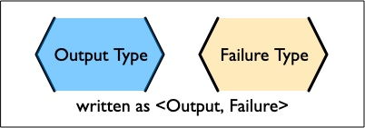
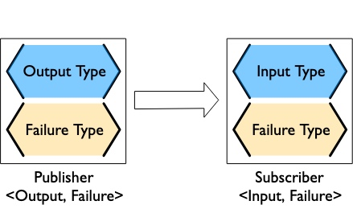

# 1-1Publisher and Subscriber

Two key concepts, publisher and subscriber, are described in Swift as protocols.
Swift中以协议的形式描述了两个关键概念，即发布者和订阅者。


When you are talking about programming (and especially with Swift and Combine), quite a lot is described by the types. When you say a function or method returns a value, that value is generally described as being "one of this type".

当你在谈论编程时（尤其是使用Swift和Combine），相当多的东西是由类型来描述的。当你说一个函数或方法返回一个值时，这个值一般被描述为 "这种类型的一个"。


```
in this respect 在这方面
upon request 根据请求
available adj. 可获得的；可购得的；可找到的；有空的
```
The first core concept to introduce **`in this respect`** is the publisher. A publisher provides data when available and **`upon request`**. A publisher that has not had any subscription requests will not provide any data. When you are describing a Combine publisher, you describe it with two associated types: one for Output and one for Failure.
在这方面要介绍的第一个核心概念是发布者。Publisher提供被要求提供的数据，在拥有这个数据的时候。一个没有任何订阅请求的Publisher不会提供任何数据。当你在描述一个Combine Publisher时，你会用两个相关的类型来描述它：一个是Output，一个是Failure。




```
the generics syntax 泛型语法
```

These are often written using the generics syntax which uses the < and > symbol around text describing the types. This represents that we are talking about a generic instance of this type of value. For example, if a publisher returned an instance of String, and could return a failure in the form of an instance of URLError, then the publisher might be described with the string <String, URLError>.

这些通常使用泛型语法，在表示类型的文本周围使用<和>符号。这代表我们谈论的是这种类型的值的一个通用实例。例如，如果一个Publisher返回了一个String的实例，并且可以以URLError实例的形式返回失败，那么发布者可能会被描述为字符串<String，URLError>。


The corresponding concept that matches with a publisher is a subscriber, and is the second core concept to introduce.
与发布者相对应的概念是订阅者，是第二个要引入的核心概念。

A subscriber is responsible for requesting data and accepting the data (and possible failures) provided by a publisher. A subscriber is described with two associated types, one for Input and one for Failure. The subscriber initiates the request for data, and controls the amount of data it receives. It can be thought of as "driving the action" within Combine, as without a subscriber, the other components stay idle.

Subscriber负责请求数据和接受由Publisher提供的数据（和可能的失败）。一个Subscriber被描述为两个相关的类型，一个用于输入，一个用于失败。用户发起对数据的请求，并控制其接收数据的数量。它可以被认为是Combine中的 "驱动行动"，因为没有Subscriber，其他组件就会闲置。

Publishers and subscribers are meant to be connected, and make up the core of Combine. When you connect a subscriber to a publisher, `both types must match`: `Output to Input, and Failure to Failure`. One way to visualize this is as a series of operations on two types in parallel, where both types need to match in order to plug the components together.

Publisher和Subscriber是要连接起来的，它们构成了Combine的核心。当你把一个Subscriber和一个Publisher连接起来时，这两种类型必须匹配。输出到输入，失败到失败。一种可视化的方式是将其可视化为对两种类型并行的一系列操作，两种类型需要匹配才能将组件插在一起。



```
acts like 像
acts both like 即像又像
adopt both 同时采用
```
The third core concept is an operator - an object that acts both like a subscriber and a publisher. Operators are classes that adopt both the Subscriber protocol and Publisher protocol. They support subscribing to a publisher, and sending results to any subscribers.

第三个核心概念是操作符--一个既像订阅者又像发布者的对象。操作符是同时采用Subscriber协议和Publisher协议的类。它们支持订阅发布者，并向任何订阅者发送结果。


You can create chains of these together, for processing, reacting, and transforming the data provided by a publisher, and requested by the subscriber.

I’m calling these `composed sequences` `pipelines`.
你可以这些一起创建成一个chain，用于处理、反应和转换由发布者提供的、由订阅者请求的数据。

我把这些组成的序列称为管道。


```
aligned v. 结盟；支持；使成一直线；校准；安放，排列；使一致（align 的过去式和过去分词）

```
Operators can be used to transform either values or types - both the Output and Failure type. Operators may also split or duplicate streams, or merge streams together. Operators `must always be` aligned by the combination of Output/Failure types. The compiler will enforce the matching types, so getting it wrong will result in a compiler error (and, if you are lucky, a useful fixit snippet suggesting a solution).


操作符可以用来转换值或类型--输出和失败类型。操作符还可以分割或复制流，或将流合并在一起。操作符必须始终通过输出/失败类型的组合来对齐。编译器将强制执行匹配的类型，所以弄错了会导致一个编译器错误（如果你幸运的话，还会有一个有用的fixit代码段提出解决方案）。

A simple Combine pipeline written in swift might look like:

用swift编写的一个简单的Combine流水线可能是这样的。


```swift
let _ = Just(5) 
    .map { value -> String in 
        // do something with the incoming value here
        // and return a string
        return "a string"
    }
    .sink { receivedValue in 
        // sink is the subscriber and terminates the pipeline
        print("The end result was \(receivedValue)")
    }
```


```swift
//管道从发布者Just开始，它以其定义的值（在本例中，整数5）进行响应。输出类型是<Integer>，失败类型是<Never>。
//Publish<Interger,Never>(5)
let _ = Just(5) 
    .map { value -> String in 
        //	然后，流水线有一个map操作符，它正在转换值及其类型。在这个例子中，它是忽略发布的输入，返回一个字符串。这也是将输出类型转换为<字符串>，并将失败类型仍然设置为<Never>。
        // do something with the incoming value here
        // and return a string
        return "a string"
    }
    .sink { receivedValue in 
         //然后，管道的末端是一个sink Subscriber
        // sink is the subscriber and terminates the pipeline
        print("The end result was \(receivedValue)")
    }
```


When you are thinking about a pipeline you can think of it as a sequence of operations linked by both output and failure types. This pattern will come in handy when you start constructing your own pipelines. When creating pipelines, you are often selecting operators to help you transform the data, types, or both to achieve your end goal. That end goal might be enabling or disabling a user interface element, or it might be retrieving some piece of data to be displayed. Many Combine operators are specifically created to help with these transformations.

当你在考虑一个管道时，你可以把它看作是一个由输出和失败类型连接的操作序列。当你开始构建自己的管道时，这种模式会很方便。在创建管道时，你经常选择操作符来帮助你转换数据、类型或两者，以实现你的最终目标。这个最终目标可能是启用或禁用一个用户界面元素，也可能是检索一些要显示的数据。许多Combine运算符是专门为帮助这些转换而创建的。

```
indicates v. 表明（indicate的第三人称单数形式）；指示，显示

```
There are `a number of operators` that have a similar operator prefixed with try, which indicates `they return an <Error> failure type`. An example of this is map and tryMap. The map operator allows for any combination of Output and Failure type and passes them through. tryMap accepts any Input, Failure types, and allows any Output type, but will `always output an <Error> failure type`.
有一些操作符的前缀是try，这表示它们返回的是<Error>失败类型。一个例子是map和tryMap。map运算符允许输出和失败类型的任意组合，并将它们传递过去。 tryMap接受任何输入、失败类型，并允许任何输出类型，但将始终输出一个<Error>失败类型。

Operators like map allow you `to define` the output type `being returned` by `inferring the output type based on` what you return in `a closure provided to the operator`. In the example above, the map operator is returning a String output type since that it what the closure returns.

像map这样的操作符允许你根据提供给操作符的闭包中返回的内容来推断输出类型，从而定义被返回的输出类型。在上面的例子中，map操作符返回的是String输出类型，因为闭包返回的就是这个类型。

```
illustrate vt. 阐明，举例说明；图解
concretely adv. 具体地

```
To illustrate `the example of changing types` more concretely, we expand upon the logic `to use the values being passed`. This example still starts with a publisher providing the types <Int, Never> and end with a subscription taking the types <String, Never>.

为了更具体地说明改变类型的例子，我们将逻辑扩展到使用被传递的值。这个例子仍然以发布者提供类型<Int，Never>开始，以订阅者采取类型<String，Never>结束。


```swift

//Publisher<Int,Never>
let _ = Just(5) 
    .map { value -> String in 
        switch value {
        case _ where value < 1:
            return "none"
        case _ where value == 1:
            return "one"
        case _ where value == 2:
            return "couple"
        case _ where value == 3:
            return "few"
        case _ where value > 8:
            return "many"
        default:
            return "some"
        }
    }
    //Subscriber<String,Never>
    .sink { receivedValue in 
        print("The end result was \(receivedValue)")
    }
```

 You can view Combine publishers, operators, and subscribers as having two parallel types that both need to be aligned - one for the functional case and one for the error case. Designing your pipeline is frequently choosing how to convert one or both of those types and the associated data with it.

您可以将Combine发布者、操作者和订阅者视为具有两种并行类型，这两种类型都需要对齐--一种用于功能情况，一种用于错误情况。设计你的管道时，经常选择如何转换这两种类型中的一种或两种类型以及与之相关的数据。

