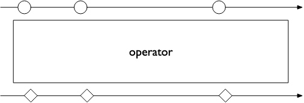
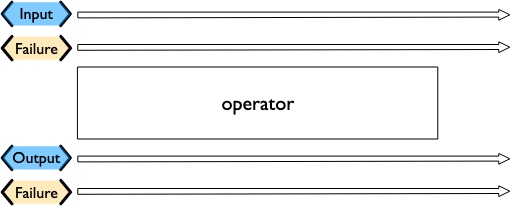
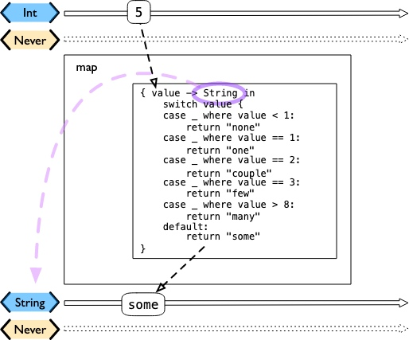

# 1-2Describing pipelines with marble diagrams


```swift
and so forth 等等
```

A functional reactive pipeline can be tricky to understand. A publisher is generating and sending data, operators are reacting to that data and potentially changing it, and subscribers requesting and accepting it. That in itself would be complicated, but some operators in Combine also may change the timing when events happen - introducing `delays`, `collapsing multiple values into one`, `and so forth`. Because these can be complex to understand, the functional reactive programming community illustrates these changes with a visual description called `a marble diagram`.

功能性的反应式管道可能是很难理解的。发布者正在生成和发送数据，操作者正在对这些数据做出反应并可能改变数据，订阅者请求和接受数据。这本身就会很复杂，但Combine中的一些操作者也可能会改变事件发生的时间--引入延迟，将多个值折叠成一个，等等。因为这些可能是复杂的，难以理解，所以功能反应式编程社区用一种叫做Marble Diagram的可视化描述来说明这些变化。

As you explore the concepts behind Combine, you may find yourself looking at other functional reactive programming systems, such as RxSwift or ReactiveExtensions. The documentation associated with these systems often use marble diagrams.

当你探索Combine背后的概念时，你可能会发现自己在研究其他功能反应式编程系统，如RxSwift或ReactiveExtensions。与这些系统相关的文档经常使用Marble Diagrams
。

Marble diagrams focus on describing how a specific pipeline changes the stream of data. It shows data changing over time, as well as the timing of those changes.

Marble Diagrams侧重于描述特定管道如何改变数据流。它显示了数据随时间的变化，以及这些变化的时间。


`Figure 1. An example marble diagram
`

## How to read a marble diagram:
The diagram centers around whatever element is being described, an operator in this case. The name of the operator is often on the central block.
该图的中心是围绕被描述的任何元素，在这种情况下是一个操作者。运算符的名称通常在中心块上。

The lines above and below represent data moving through time. The left is earlier and the right is later. The symbols on the line represent discrete bits of data.
上面和下面的线条代表数据在时间上的移动。左边是较早，右边是较晚。线条上的符号代表数据的离散位。

It is often assumed that data is flowing downward. With this pattern, the top line is indicating the inputs to the operator and the bottom line represents the outputs.
通常认为数据是向下流动的。在这种模式下，上面的线是表示运算器的输入，下面的线代表输出。

In some diagrams, the symbols on the top line may differ from the symbols on the bottom line. When they are different, the diagram is typically implying that the type of the output is different from the type of the input.
在一些图中，顶线上的符号可能与底线上的符号不同。当它们不同时，图中通常暗示输出的类型与输入的类型不同。

In other places, you may also see a vertical bar or an X on the timeline, or ending the timeline. That is used to indicate the end of a stream. A bar at the end of a line implies the stream has terminated normally. An X indicates that an error or exception was thrown.
在其他地方，你也可能会看到时间线上的一个竖条或一个X，或者结束时间线。那是用来表示一个流的结束。行结束时的条状物意味着流已正常终止。一个X表示抛出了一个错误或异常。

These diagrams intentionally ignore the setup (or teardown) of a pipeline, preferring to focus on one element to describe how that element works.
这些图有意忽略了管道的设置（或拆解），更愿意专注于一个元素来描述该元素如何工作。


## Marble diagrams for Combine
This book uses an expansion of the basic marble diagram, modified slightly to highlight some of the specifics of Combine. The most notable difference are two lines for input and output. Since Combine explicitly types both the input and the failure, these are represented separately and the types described in the diagram.

本书采用了基本大理石图的扩展，稍作修改，突出了Combine的一些具体内容。最显著的区别是输入和输出的两行。由于Combine明确地对输入和故障进行了类型化处理，所以将这些类型分开表示，并在图中进行描述。


`Figure 2. An expanded Combine specific marble diagram`

If a publisher is being described, the two lines are below the element, following the pattern of "data flows down". An operator, which acts as both a publisher and subscriber, would have two sets - one above and one below. A subscriber has the lines above it.
如果描述的是发布者，则两行在元素的下方，遵循 "数据向下流动 "的模式。一个运算符，它既是发布者又是订阅者，会有两组--一组在上面，一组在下面。一个订阅者则有上面的线条。

To illustrate how these diagrams relate to code, let’s look at a simple example. In this case, we will focus on the map operator and how it can be described with this diagram.
为了说明这些图与代码的关系，我们来看一个简单的例子。在这个例子中，我们将重点关注地图操作符以及如何用这个图来描述它。


```Swift
//Publish接收的是5 但是发送出去的仍然是<String,Never>
//提供给.map()函数的闭包接收一个<Int>并将其转换为<String>。由于<Never>的失败类型没有改变，所以它被传递过来。

let _ = Just(5)
    .map { value -> String in 
        switch value {
        case _ where value < 1:
            return "none"
        case _ where value == 1:
            return "one"
        case _ where value == 2:
            return "couple"
        case _ where value == 3:
            return "few"
        case _ where value > 8:
            return "many"
        default:
            return "some"
        }
    }
    .sink { receivedValue in
        print("The end result was \(receivedValue)")
    }
```

The following diagram represents this code snippet. This diagram goes further than others in this book; it includes the closure from the sample code in the diagram to show how it relates.

下图表示这个代码片段。这张图比本书中的其他图更进一步；它在图中包含了示例代码中的闭合，以显示其关系。


Figure 3. The example map operator from the code above:

Many combine operators are configured with code provided by you, written in a closure. Most diagrams will not attempt to include it in the diagram. It is implied that any code you provide through a closure in Combine will be used within the box rather than explicitly detailed.

许多Combine运算符都是用你提供的代码配置的，写在一个闭包里。大多数图不会试图将其包含在图中。这意味着您在Combine中通过闭包提供的任何代码将在框内使用，而不是明确地详细说明。

The input type for this map operator is <Int>, which is described with generic syntax on the top line. The failure type that is being passed to this operator is <Never>, described in the same syntax just below the Input type.

The map operator doesn’t change or interact with the failure type, only passing it along. To represent that, the failure types - both input (above) and output (below) - have been lightened.

A single input value provided (5) is represented on the top line. The location on the line isn’t meaningful in this case, only representing that it is a single value. If multiple values were on the line, the ones on the left would be presented to the map operator before any on the right.

这个映射操作符的输入类型是<Int>，在顶行用通用语法描述。传递给这个操作符的失败类型是<Never>，在输入类型的下面用同样的语法描述。

映射操作符并不改变或与失败类型交互，只是将其传递过来。为了表示这一点，失败类型--输入（上面）和输出（下面）--都被减轻了。

提供的单个输入值(5)在上行表示。在这种情况下，线上的位置没有意义，只代表这是一个单一的值。如果行上有多个值，那么左边的值会先于右边的值呈现给地图操作员。

When it arrives, the value 5 is passed to the closure as the variable value. The return type of the closure (<String> in this case), defines the output type for the map operator. When the code within the closure completes and returns its value. In this case, the string some is returned for the input value 5. The string some is represented on the output line directly below its input value, implying there was no explicit delay.

当它到达时，值5作为变量值传递给闭包。闭包的返回类型(本例中为<String>)，定义了映射Operator的输出类型。当闭包内的代码完成并返回其值时。在本例中，对于输入值5，返回的是字符串some。字符串some在输出行上直接表示在其输入值的下面，意味着没有明确的延迟。

Most diagrams in this book won’t be as complex or detailed as this example. Most of these diagrams will focus on describing the operator. This one is more complex to illustrate how the diagrams can be interpreted and how they relate to your code.

本书中的大多数图表不会像这个例子一样复杂或详细。这些图大多会集中在描述运算符上。这张图比较复杂，是为了说明如何解释这些图，以及它们与你的代码之间的关系。

