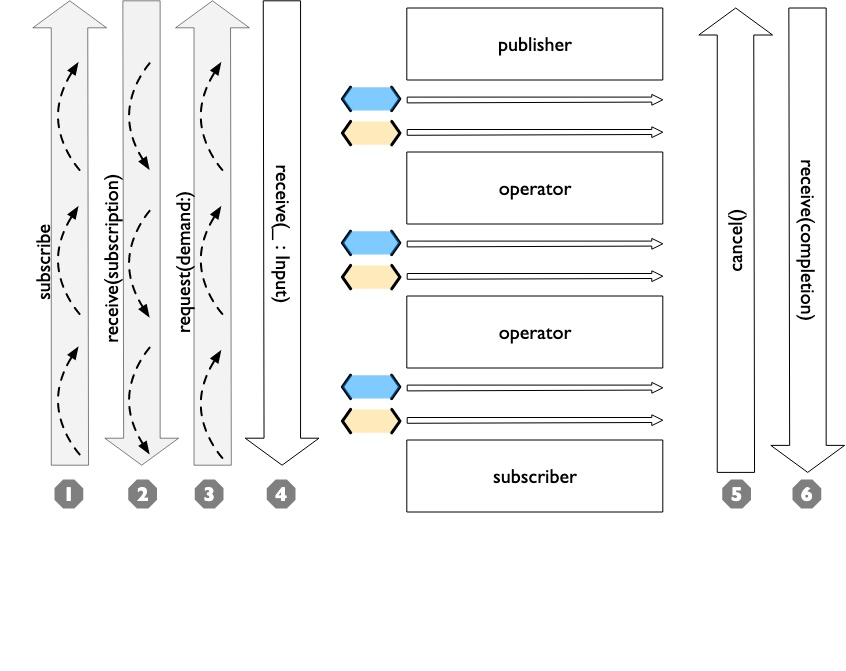

# 1-4Lifecycle of Publishers and Subscribers
The end to end lifecycle is enabled by subscribers and publishers communicating in a well defined sequence:
通过订阅者和发布者以明确的顺序进行沟通，实现了端到端的生命周期。



1.When the subscriber is attached to a publisher, it starts with a call to .subscribe(_: Subscriber).
`当订阅者连接到一个发布者时，它首先调用.subscribe(_: Subscriber)。`

2.The publisher in turn acknowledges the subscription calling receive(subscription: Subscription).
`发布者则调用receive(subscription: Subscription)来确认订阅。`

3.After the subscription has been acknowledged, the subscriber requests N values with request(_: Demand).
`在订阅被确认后，订阅者用 request(_: Demand) 请求 N 个值。`

4.The publisher may then (as it has values) send N (or fewer) values using receive(_: Input). A publisher should never send more than the demand requested.
`发布者永远不应该发送超过请求的需求。`

5.Any time after the subscription has been acknowledged, the subscriber may send a cancellation with .cancel()
`在订阅被确认后的任何时候，订阅者都可以用.cancel()发送一个取消。`
6.A publisher may optionally send completion: receive(completion:). A completion can be either a normal termination, or may be a .failure completion, optionally propagating an error type. A pipeline that has been cancelled will not send any completions.
```
发布者可以选择发送完成。receive(completion:)。
一个完成可以是一个正常的终止，也可以是一个.失败的完成，可以选择传播一个错误类型。
一个已经被取消的管道将不会发送任何完成。
```

Included in the above diagram is a stacked up set of the example marble diagrams. This is to highlight where Combine marble diagrams focus in the overall lifecycle of a pipeline. Generally the diagrams infer that all of the setup has been done and data requested. The heart of a combine marble diagram is the series of events between when data was requested and any completions or cancellations are triggered.

上图中包含了一组叠加的大理石图示例。这是为了突出Combine大理石图在整个流水线的生命周期中的重点所在。一般来说，这些图推断出所有的设置都已经完成，并且请求了数据。组合大理石图的核心是从数据被请求到任何完成或取消被触发之间的一系列事件。

