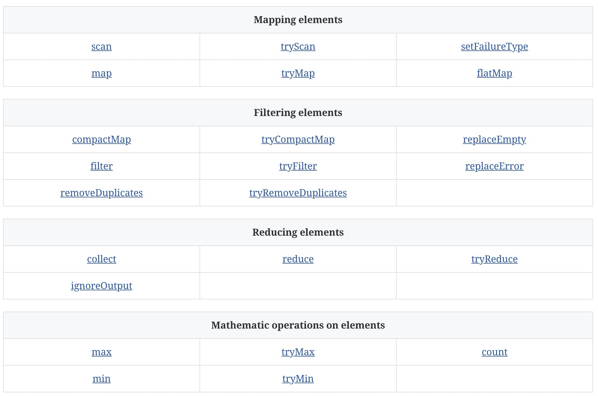
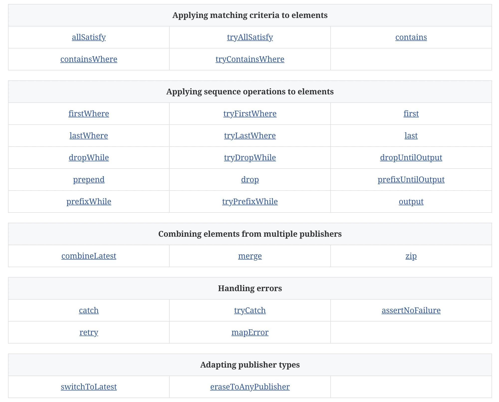
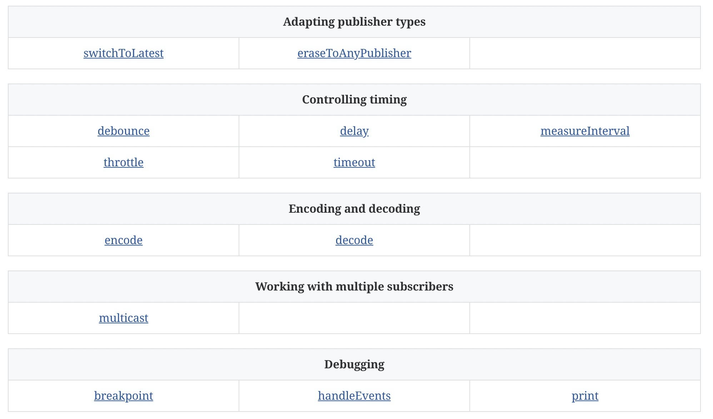

# 1-6Operators

Operators are a convenient name for a number of pre-built functions that are included under Publisher in Apple’s reference documentation. Operators are meant to be composed into pipelines. Many will accept one or more closures from the developer to define the business logic while maintaining the adherence to the publisher/subscriber lifecycle.

Some operators support bringing together outputs from different pipelines, changing the timing of data, or filtering the data provided. Operators may also have constraints on the types they will operate on. Operators can also be used to define error handling and retry logic, buffering and prefetch, and supporting debugging.

操作符是苹果参考文档中Publisher下包含的一些预建函数的方便名称。操作符是为了组成管道。许多人会接受开发人员的一个或多个闭包，以定义业务逻辑，同时保持对发布者/订阅者生命周期的遵守。

一些操作员支持将不同管道的输出汇集在一起，改变数据的时间，或过滤所提供的数据。操作符还可以对它们将操作的类型进行限制。操作符还可以用来定义错误处理和重试逻辑、缓冲和预取，以及支持调试。

